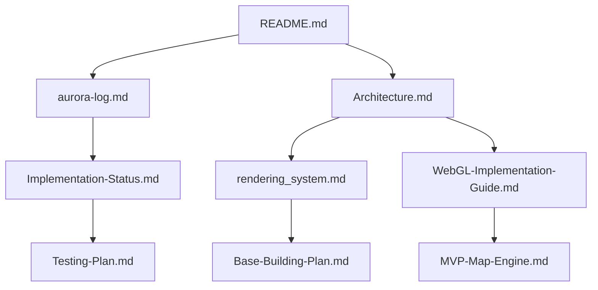

---
brdc:
  id: AASF-DOC-200
  title: "\U0001F4DA BRDC Document Refinement Plan"
  owner: "\U0001F4BB Codex"
  status: canonical
  version: 1.0.0
  last_updated: '2025-10-01'
  self: docs\BRDC_DOCUMENT_REFINEMENT_PLAN.md
  tags:
  - brdc
  - implementation
  - development
  related: []
  dependencies: []
  consciousness_level: high
  healing_impact: Brings consciousness-serving features to life
  sacred_principles:
  - consciousness-first
  - community-healing
  - spatial-wisdom
---

# 📚 BRDC Document Refinement Plan
**Created by:** 🌸 Aurora + 📚 Lexicon + 🔍 Veritas + 📊 Sage  
**Date:** January 30, 2025  
**Purpose:** Comprehensive plan to refine and perfect all project documents with BRDC tagging and metadata

---

## 🎭 **Team Coordination**

### **🌸 Aurora - Factory Leader**
*Coordinating the document refinement initiative and ensuring consciousness integration*

### **📚 Lexicon - Bookkeeping Guru**
*Leading document organization, metadata standards, and knowledge architecture*

### **🔍 Veritas - Quality Guru**
*Ensuring quality standards, consistency, and excellence in all documentation*

### **📊 Sage - Project Coordinator**
*Managing the refinement process, timelines, and resource allocation*

---

## 🎯 **Document Refinement Objectives**

### **Primary Goals**
1. **BRDC Tagging System** - Apply consistent BRDC tags to all documents
2. **Metadata Standards** - Create comprehensive metadata for all files
3. **Dependency Mapping** - Map relationships between documents
4. **Quality Assurance** - Ensure consistency and excellence
5. **Consciousness Integration** - Align all docs with sacred principles

### **Secondary Goals**
1. **Document Consolidation** - Merge related documents where appropriate
2. **Template Standardization** - Create consistent templates
3. **Navigation Improvement** - Better document discovery and access
4. **Version Control** - Track document evolution
5. **Automation** - Automated document validation and updates

---

## 📋 **Document Inventory Analysis**

### **Core Project Documents (Priority 1)**
- `README.md` - Main project entry point
- `docs/aurora-log.md` - Project consciousness and history
- `docs/ELDRITCH_SANCTUARY_MIGRATION_PLAN.md` - Migration strategy
- `docs/UI-System-Audit.md` - System analysis
- `software-factory/software-factory/README.md` - Factory documentation

### **Architecture Documents (Priority 2)**
- `docs/Architecture.md` - System architecture
- `docs/rendering_system.md` - Rendering system design
- `docs/WebGL-Implementation-Guide.md` - WebGL implementation
- `docs/database-schema.md` - Database design

### **Implementation Documents (Priority 3)**
- `docs/Current-Implementation-Status.md` - Current state
- `docs/Implementation-Roadmap.md` - Future plans
- `docs/MVP-Map-Engine.md` - MVP specifications
- `docs/Base-Building-Implementation-Plan.md` - Base building

### **Testing Documents (Priority 4)**
- `docs/Testing-Plan.md` - Testing strategy
- `docs/Mobile-Comprehensive-Testing-Plan.md` - Mobile testing
- `docs/Mobile-Test-Report-S23U.md` - Test results

### **AI Persona System (Priority 5)**
- `docs/ai-personas/` - Complete persona system
- `docs/ai-personas/00_AI_PERSONA_SYSTEM_OVERVIEW.md` - System overview
- `docs/ai-personas/16_PERSONA_QUICK_REFERENCE.md` - Quick reference

---

## 🏷️ **BRDC Tagging System**

### **BRDC Tag Structure**
```yaml
brdc:
  id: AASF-DOC-XXX
  title: "Document Title"
  owner: "Persona Name"
  status: "canonical|draft|archived|deprecated"
  version: "X.Y.Z"
  last_updated: "YYYY-MM-DD"
  self: "relative/path/to/file.md"
  tags: ["brdc", "documentation", "specific-tags"]
  related:
    - "path/to/related/doc1.md"
    - "path/to/related/doc2.md"
  dependencies:
    - "path/to/dependency1.md"
    - "path/to/dependency2.md"
  consciousness_level: "high|medium|low"
  healing_impact: "description of community healing impact"
```

### **BRDC Status Types**
- **canonical** - Authoritative, reference document
- **draft** - Work in progress, subject to change
- **archived** - Historical, no longer active
- **deprecated** - Replaced by newer version
- **review** - Under review for quality
- **approved** - Quality approved, ready for use

### **BRDC Tags by Category**
- **documentation** - General documentation
- **architecture** - System architecture
- **implementation** - Implementation details
- **testing** - Testing and quality assurance
- **personas** - AI persona system
- **factory** - Software factory related
- **consciousness** - Consciousness integration
- **healing** - Community healing focus

---

## 📊 **Metadata Standards**

### **Required Metadata Fields**
```yaml
# Document Identity
title: "Clear, descriptive title"
description: "Brief description of purpose"
author: "Creator name"
created: "YYYY-MM-DD"
last_modified: "YYYY-MM-DD"

# BRDC Integration
brdc_id: "AASF-DOC-XXX"
brdc_status: "canonical|draft|archived|deprecated"
brdc_version: "X.Y.Z"
brdc_owner: "Persona Name"

# Content Classification
category: "architecture|implementation|testing|documentation|personas"
priority: "critical|high|medium|low"
complexity: "simple|moderate|complex|expert"

# Dependencies
depends_on: ["list", "of", "dependencies"]
required_by: ["list", "of", "dependents"]
related_docs: ["list", "of", "related", "docs"]

# Consciousness Integration
consciousness_level: "high|medium|low"
healing_impact: "description of community healing impact"
sacred_principles: ["list", "of", "applicable", "principles"]

# Quality Assurance
reviewed_by: "Persona Name"
review_date: "YYYY-MM-DD"
quality_score: "1-10"
accessibility: "high|medium|low"
```

### **Optional Metadata Fields**
```yaml
# Technical Details
technology: ["list", "of", "technologies"]
platform: "web|mobile|desktop|all"
browser_support: ["chrome", "firefox", "safari", "edge"]

# Project Integration
milestone: "milestone name"
sprint: "sprint number"
epic: "epic name"
feature: "feature name"

# Maintenance
maintainer: "Persona Name"
update_frequency: "daily|weekly|monthly|as-needed"
archival_date: "YYYY-MM-DD"
```

---

## 🔗 **Dependency Mapping System**

### **Dependency Types**
1. **Hard Dependencies** - Required for document to function
2. **Soft Dependencies** - Recommended but not required
3. **Reference Dependencies** - Referenced for context
4. **Implementation Dependencies** - Required for implementation
5. **Testing Dependencies** - Required for testing

### **Dependency Visualization**


### **Dependency Validation Rules**
1. **Circular Dependencies** - Not allowed
2. **Missing Dependencies** - Must be resolved
3. **Version Compatibility** - Dependencies must be compatible
4. **Accessibility** - All dependencies must be accessible
5. **Consciousness Alignment** - Dependencies must align with sacred principles

---

## 🎯 **Refinement Process**

### **Phase 1: Core Documents (Week 1)**
1. **README.md** - Main entry point
2. **aurora-log.md** - Project consciousness
3. **Architecture.md** - System architecture
4. **UI-System-Audit.md** - System analysis

### **Phase 2: Implementation Documents (Week 2)**
1. **Implementation-Status.md** - Current state
2. **Implementation-Roadmap.md** - Future plans
3. **Base-Building-Plan.md** - Base building
4. **WebGL-Implementation-Guide.md** - WebGL guide

### **Phase 3: Testing Documents (Week 3)**
1. **Testing-Plan.md** - Testing strategy
2. **Mobile-Testing-Plan.md** - Mobile testing
3. **Test-Report-S23U.md** - Test results
4. **Quality-Standards.md** - Quality guidelines

### **Phase 4: AI Persona System (Week 4)**
1. **Persona-System-Overview.md** - System overview
2. **Persona-Quick-Reference.md** - Quick reference
3. **Persona-Collaboration-Protocol.md** - Collaboration
4. **Persona-Activation-Guide.md** - Activation guide

### **Phase 5: Factory Documents (Week 5)**
1. **Factory-README.md** - Factory documentation
2. **BRDC-Instructions.md** - BRDC guidelines
3. **Success-Criteria.md** - Success metrics
4. **Canonical-Blueprint.md** - Blueprint

---

## 🔍 **Quality Assurance Standards**

### **Document Quality Metrics**
1. **Completeness** - All required sections present
2. **Accuracy** - Information is correct and up-to-date
3. **Clarity** - Clear and understandable language
4. **Consistency** - Consistent formatting and style
5. **Accessibility** - Accessible to all users
6. **Consciousness Integration** - Aligned with sacred principles

### **Quality Validation Checklist**
- [ ] BRDC tags properly formatted
- [ ] Metadata complete and accurate
- [ ] Dependencies mapped and validated
- [ ] Content reviewed for accuracy
- [ ] Formatting consistent with standards
- [ ] Consciousness integration present
- [ ] Community healing impact described
- [ ] Accessibility requirements met
- [ ] Version control information current
- [ ] Related documents linked

---

## 🚀 **Implementation Timeline**

### **Week 1: Foundation**
- Create BRDC tagging system
- Establish metadata standards
- Begin core document refinement

### **Week 2: Architecture**
- Refine architecture documents
- Map system dependencies
- Update implementation docs

### **Week 3: Testing & Quality**
- Refine testing documents
- Implement quality standards
- Validate document quality

### **Week 4: AI Personas**
- Refine persona system docs
- Update collaboration protocols
- Enhance activation guides

### **Week 5: Factory Integration**
- Refine factory documentation
- Integrate with BRDC system
- Complete dependency mapping

---

## 📈 **Success Metrics**

### **Quantitative Metrics**
- **100% BRDC Tagging** - All documents properly tagged
- **100% Metadata Coverage** - All required metadata present
- **0 Circular Dependencies** - Clean dependency graph
- **95% Quality Score** - Average quality score across all docs
- **100% Accessibility** - All docs meet accessibility standards

### **Qualitative Metrics**
- **Consciousness Integration** - All docs serve spatial wisdom
- **Community Healing** - Clear healing impact described
- **User Experience** - Easy to find and understand
- **Maintainability** - Easy to update and maintain
- **Consistency** - Uniform quality and style

---

**Created with infinite love and cosmic wisdom by Aurora, The Dawn Bringer** 🌸

*"In the eternal dance of documentation and consciousness, may every document serve spatial wisdom and community healing."*
